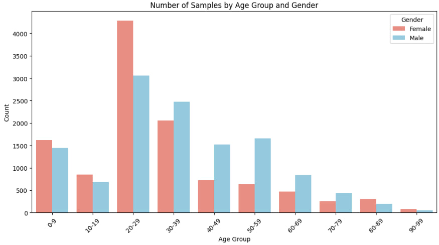

#  Age and Gender Estimation from Face Images

The main goal of this project is to develop a deep learning model that can **predict a person’s Age and Gender from facial images**.  
Accurate age prediction has strong value across multiple domains, such as:

- **Security & Access Control:** Enhancing verification systems by automatically detecting age groups.  
- **Demographic Analytics:** Providing insights into user populations for research or business intelligence.  
- **Personalized Advertising:** Delivering content or recommendations based on estimated age.  
- **Human-Computer Interaction:** Enabling adaptive interfaces that respond differently depending on the user’s age.  

# Data Understanding  

The dataset used in this project is the **UTKFace dataset**, which contains over **20,000 facial images** covering a wide range of ages, genders, and ethnicities.  

Each image filename encodes the labels in the following format:  
`[age]_[gender]_[ethnicity]_[date&time].jpg`  

Example:  
`25_0_0_20170116174525125.jpg`  
- `25` → Age (in years)  
- `0` → Gender (0 = Male, 1 = Female)  
- `0` → Ethnicity (0 = White, 1 = Black, 2 = Asian, 3 = Indian, 4 = Others)  

For this project, **only the age label is used** as the prediction target.  

### Key Characteristics of the Dataset
- **Age Range:** 0 to 116 years old  
- **Image Variability:** Different poses, lighting conditions, facial expressions, and resolutions  
- **Label Quality:** Age labels are approximate in some cases (may contain noise)  
- **Class Imbalance:** Certain age ranges (e.g., young adults) are overrepresented, while extreme ages (children and elderly) are underrepresented  

This imbalance can influence model performance, making **error analysis across age groups** an important part of evaluation.  

# Data Collection  

The dataset is publicly available and can be accessed through:  
- [UTKFace Dataset (Google Drive)](https://drive.google.com/drive/folders/19zV45_NQzrBPLzFymXeNZiufxbeENGth)  

Since Kaggle does not provide this dataset by default, the typical workflow is:  
1. **Download** the dataset locally.  
2. **Upload** it as a Kaggle Dataset.  
3. **Attach** it to the Kaggle Notebook for seamless execution.  

This ensures reproducibility and allows for consistent experimentation across different runs.  

## Results

The current model has achieved the following:

- Gender classification accuracy: **89.7%** (training) and **63.2%** (validation)  
- Age estimation MAE: **1.97 years** (training) and **6.51 years** (validation)  
- Age range accuracy: **80.7%** (training) and **54.3%** (validation)  

The project is still in progress, and I am working on improving the performance further.
